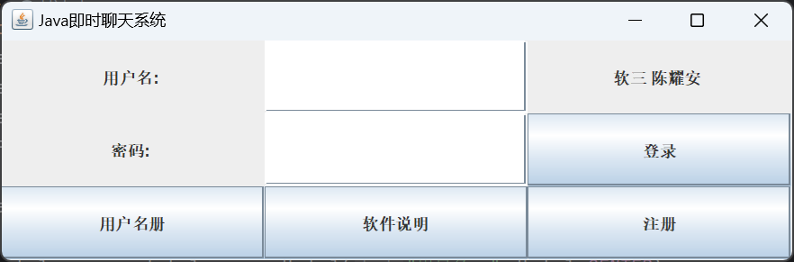
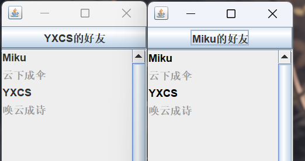
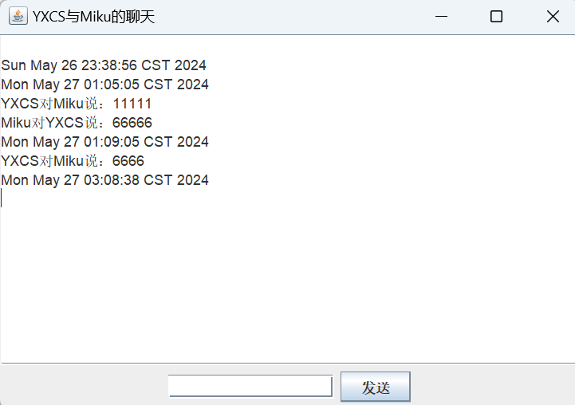
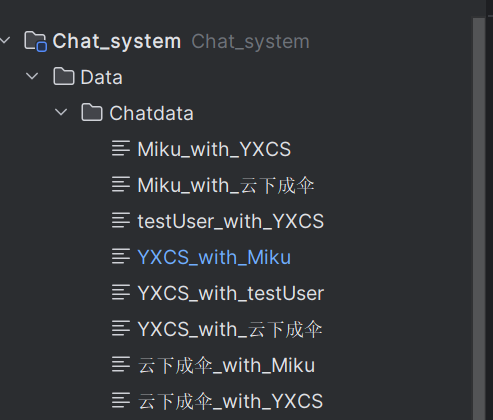

# Java Instant Messaging System (Online-Chat)

> A multi-threaded instant messaging system built with Java and TCP/IP Socket communication

---

## 🧩 Project Overview
This project implements a desktop instant messaging system using **Java TCP/IP network programming**.  
It features real-time communication between multiple clients and a central server through **Socket** connections, **multi-threading**, and **object serialization**.  
The system provides a complete client–server messaging architecture with GUI interfaces and persistent chat history storage.

- **Language:** Java  
- **Communication Protocol:** TCP/IP  
- **Core Technologies:** Socket, ServerSocket, Multi-threading, Object Streams, File I/O  
- **Key Features:** Login & Registration, Friend List, Real-Time Chat, Persistent Message Storage  

---

## 🧰 Technical Highlights
| Module | Description |
|--------|--------------|
| **Network Communication** | Implements reliable connections via `Socket` and `ServerSocket` based on the TCP protocol |
| **Message Serialization** | Custom `Message` class and `MessageType` interface used for encoding and decoding data packets |
| **Concurrent Server** | Each client connection is handled by an independent thread to support multiple simultaneous users |
| **I/O and Object Streams** | Uses `ObjectInputStream` and `ObjectOutputStream` for object-level message transmission |
| **GUI Interface** | Built with `Swing`, including login, friend list, and chat windows |
| **Data Persistence** | Chat history is automatically stored locally in the `Chatdata` folder, named by user pairs |

---

## 💻 System Architecture
The system consists of three core components:

1. **Client Side**
   - Provides user login, friend list, and chat interfaces.  
   - Establishes a socket connection to the central server.  
   - Sends and receives serialized `Message` objects.  
   - Saves chat logs locally for each conversation.

2. **Server Side**
   - Uses `ServerSocket` to continuously listen for client requests.  
   - Creates a dedicated thread for each connected client.  
   - Manages online user sessions and forwards messages.  

3. **Message Definition Layer**
   - Defines communication rules through `Message` and `MessageType`.  
   - Supports login verification, text messages, and extensible message types.  

---

## 📁 Project Structure

### 🧭 Summary
- **Client/** – Handles GUI, user interactions, and Socket communication.  
- **Server/** – Manages concurrent client threads and message routing.  
- **User_data/** – Defines data models and communication protocols.  
- **Data/** – Stores persistent chat logs and user information.  

---

## 🧠 Feature Demonstration

### Login and Registration

- Users can log in with credentials or register a new account.  
- Upon successful authentication, the system connects to the server and displays the friend list.

---

### Friend List

- Displays all available contacts dynamically.  
- Double-click on a friend to start a conversation.  
- Supports multiple chat windows concurrently.

---

### Chat Window

- Real-time text communication with timestamped messages.  
- Message history is automatically written to local files.  
- Supports bi-directional messaging between any two online users.

---

### Chat Data Structure

Chat logs are automatically saved in the `Data/Chatdata` directory,  
where each file corresponds to a specific conversation:

